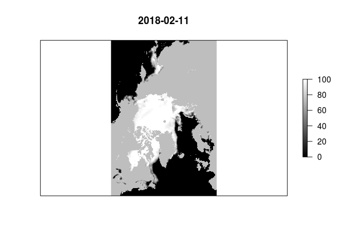

<!-- README.md is generated from README.Rmd. Please edit that file -->
seaice
======

The goal of seaice is to provide easy access to sea ice concentration data.

Seaice uses [bowerbird and blueant](https://github.com/AustralianAntarcticDivision/bowerbird) to obtain the entire collection of near-real time NSIDC 25km raw binary files, and keep it up to date. This is a manageably small set of data (&lt;300Mb) that is current, but only extends back two or three years and has some "near real time" artefacts. In future we aim to make it easy to obtain the entire time series (from late 1978), and to prioritize the better quality data as it becomes available.

Currently the file cataloguing and data read is restricted to the northern polar data, although both polar regions are downloaded, and updated when re-running `bb_sync` (see the vignettes).

This project aims to separate out similar functionality in the institutional packages \[raadtools and raadfiles\]((<https://github.com/AustralianAntarcticDivision/raadtools>) that provide a powerful but not generally accessible set of data tools.

Installation
------------

You can install seaice from GitHub with:

``` r
# install.packages("devtools")
devtools::install_github("mdsumner/seaice")
```

Example
-------

WIP - see the vignettes and the inst/examples/.

``` r
library(seaice)
library(raster)
#> Loading required package: sp
x <- read_north_seaice(latest = TRUE)
plot(x, col = grey(seq(0, 1, length = 100)), axes = FALSE, colNA = "grey")
title(format(getZ(x)))
```


